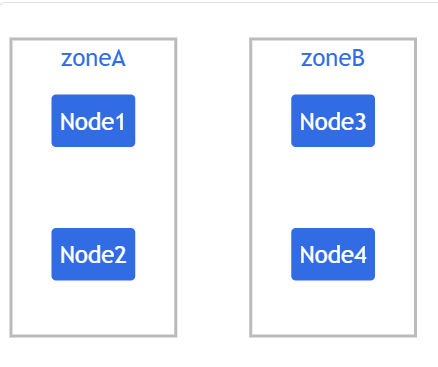
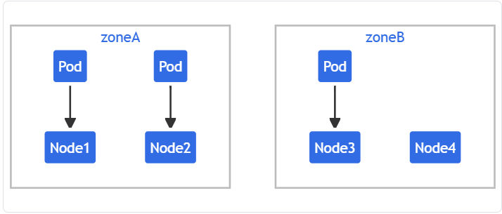
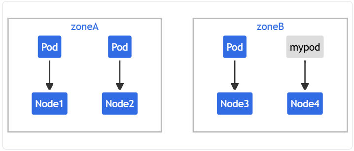
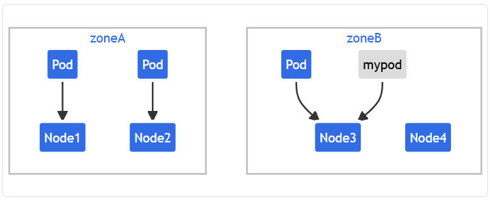
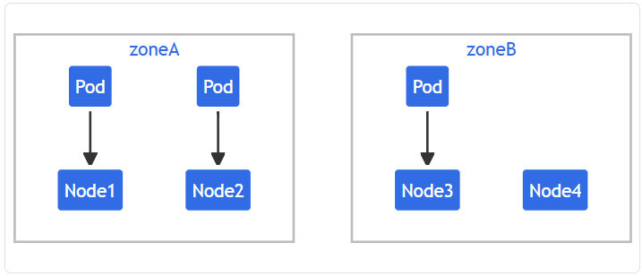
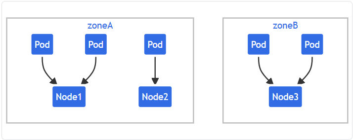
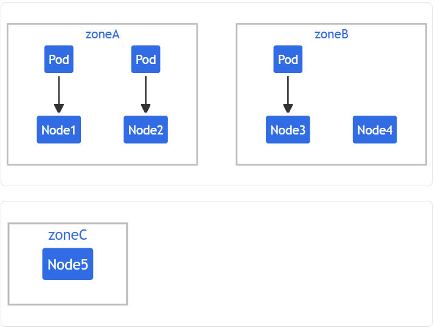

[Doc](https://kubernetes.io/docs/concepts/scheduling-eviction/topology-spread-constraints/)
You can use _topology spread constraints_ to control how [Pods](https://kubernetes.io/docs/concepts/workloads/pods/) are spread across your cluster among failure-domains such as regions, zones, nodes, and other user-defined topology domains. This can help to achieve high availability as well as efficient resource utilization.

You can set [](https://kubernetes.io/docs/concepts/scheduling-eviction/topology-spread-constraints/#cluster-level-default-constraints) as a default, or configure topology spread constraints for individual workloads.

## Motivation[](https://kubernetes.io/docs/concepts/scheduling-eviction/topology-spread-constraints/#motivation)

Imagine that you have a cluster of up to twenty nodes, and you want to run a [workload](https://kubernetes.io/docs/concepts/workloads/) that automatically scales how many replicas it uses. There could be as few as two Pods or as many as fifteen. When there are only two Pods, you'd prefer not to have both of those Pods run on the same node: you would run the risk that a single node failure takes your workload offline.

In addition to this basic usage, there are some advanced usage examples that enable your workloads to benefit on high availability and cluster utilization.

As you scale up and run more Pods, a different concern becomes important. Imagine that you have three nodes running five Pods each. The nodes have enough capacity to run that many replicas; however, the clients that interact with this workload are split across three different datacenters (or infrastructure zones). Now you have less concern about a single node failure, but you notice that latency is higher than you'd like, and you are paying for network costs associated with sending network traffic between the different zones.

You decide that under normal operation you'd prefer to have a similar number of replicas [scheduled](https://kubernetes.io/docs/concepts/scheduling-eviction/) into each infrastructure zone, and you'd like the cluster to self-heal in the case that there is a problem.

Pod topology spread constraints offer you a declarative way to configure that.

## `topologySpreadConstraints` field[](https://kubernetes.io/docs/concepts/scheduling-eviction/topology-spread-constraints/#topologyspreadconstraints-field)

The Pod API includes a field, `spec.topologySpreadConstraints`. The usage of this field looks like the following:

```yaml
---
apiVersion: v1
kind: Pod
metadata:
  name: example-pod
spec:
  # Configure a topology spread constraint
  topologySpreadConstraints:
    - maxSkew: <integer>
      minDomains: <integer> # optional
      topologyKey: <string>
      whenUnsatisfiable: <string>
      labelSelector: <object>
      matchLabelKeys: <list> # optional; beta since v1.27
      nodeAffinityPolicy: [Honor|Ignore] # optional; beta since v1.26
      nodeTaintsPolicy: [Honor|Ignore] # optional; beta since v1.26
  ### other Pod fields go here
```

You can read more about this field by running `kubectl explain Pod.spec.topologySpreadConstraints` or refer to the [](https://kubernetes.io/docs/reference/kubernetes-api/workload-resources/pod-v1/#scheduling) section of the API reference for Pod.

### Spread constraint definition[](https://kubernetes.io/docs/concepts/scheduling-eviction/topology-spread-constraints/#spread-constraint-definition)

You can define one or multiple `topologySpreadConstraints` entries to instruct the kube-scheduler how to place each incoming Pod in relation to the existing Pods across your cluster. Those fields are:

- **maxSkew** describes the degree to which Pods may be unevenly distributed. You must specify this field and the number must be greater than zero. Its semantics differ according to the value of `whenUnsatisfiable`:
    
    - if you select `whenUnsatisfiable: DoNotSchedule`, then `maxSkew` defines the maximum permitted difference between the number of matching pods in the target topology and the _global minimum_ (the minimum number of matching pods in an eligible domain or zero if the number of eligible domains is less than MinDomains). For example, if you have 3 zones with 2, 2 and 1 matching pods respectively, `MaxSkew` is set to 1 then the global minimum is 1.
    - if you select `whenUnsatisfiable: ScheduleAnyway`, the scheduler gives higher precedence to topologies that would help reduce the skew.
- **minDomains** indicates a minimum number of eligible domains. This field is optional. A domain is a particular instance of a topology. An eligible domain is a domain whose nodes match the node selector.
    
    #### Note:
    
    Before Kubernetes v1.30, the `minDomains` field was only available if the `MinDomainsInPodTopologySpread` [feature gate](https://kubernetes.io/docs/reference/command-line-tools-reference/feature-gates/) was enabled (default since v1.28). In older Kubernetes clusters it might be explicitly disabled or the field might not be available.
    
    - The value of `minDomains` must be greater than 0, when specified. You can only specify `minDomains` in conjunction with `whenUnsatisfiable: DoNotSchedule`.
    - When the number of eligible domains with match topology keys is less than `minDomains`, Pod topology spread treats global minimum as 0, and then the calculation of `skew` is performed. The global minimum is the minimum number of matching Pods in an eligible domain, or zero if the number of eligible domains is less than `minDomains`.
    - When the number of eligible domains with matching topology keys equals or is greater than `minDomains`, this value has no effect on scheduling.
    - If you do not specify `minDomains`, the constraint behaves as if `minDomains` is 1.
- **topologyKey** is the key of [](https://kubernetes.io/docs/concepts/scheduling-eviction/topology-spread-constraints/#node-labels). Nodes that have a label with this key and identical values are considered to be in the same topology. We call each instance of a topology (in other words, a <key, value> pair) a domain. The scheduler will try to put a balanced number of pods into each domain. Also, we define an eligible domain as a domain whose nodes meet the requirements of nodeAffinityPolicy and nodeTaintsPolicy.
 
- **whenUnsatisfiable** indicates how to deal with a Pod if it doesn't satisfy the spread constraint:
    
    - `DoNotSchedule` (default) tells the scheduler not to schedule it.
    - `ScheduleAnyway` tells the scheduler to still schedule it while prioritizing nodes that minimize the skew.
- **labelSelector** is used to find matching Pods. Pods that match this label selector are counted to determine the number of Pods in their corresponding topology domain. See [](https://kubernetes.io/docs/concepts/overview/working-with-objects/labels/#label-selectors) for more details.

- **matchLabelKeys** is a list of pod label keys to select the pods over which spreading will be calculated. The keys are used to lookup values from the pod labels, those key-value labels are ANDed with `labelSelector` to select the group of existing pods over which spreading will be calculated for the incoming pod. The same key is forbidden to exist in both `matchLabelKeys` and `labelSelector`. `matchLabelKeys` cannot be set when `labelSelector` isn't set. Keys that don't exist in the pod labels will be ignored. A null or empty list means only match against the `labelSelector`.
    
    With `matchLabelKeys`, you don't need to update the `pod.spec` between different revisions. The controller/operator just needs to set different values to the same label key for different revisions. The scheduler will assume the values automatically based on `matchLabelKeys`. For example, if you are configuring a Deployment, you can use the label keyed with [](https://kubernetes.io/docs/concepts/workloads/controllers/deployment/#pod-template-hash-label), which is added automatically by the Deployment controller, to distinguish between different revisions in a single Deployment.
    
    ```yaml
        topologySpreadConstraints:
            - maxSkew: 1
              topologyKey: kubernetes.io/hostname
              whenUnsatisfiable: DoNotSchedule
              labelSelector:
                matchLabels:
                  app: foo
              matchLabelKeys:
                - pod-template-hash
    ```
    
    #### Note:
    The `matchLabelKeys` field is a beta-level field and enabled by default in 1.27. You can disable it by disabling the `MatchLabelKeysInPodTopologySpread` [feature gate](https://kubernetes.io/docs/reference/command-line-tools-reference/feature-gates/).

- **nodeAffinityPolicy** indicates how we will treat Pod's nodeAffinity/nodeSelector when calculating pod topology spread skew. Options are:
    
    - Honor: only nodes matching nodeAffinity/nodeSelector are included in the calculations.
    - Ignore: nodeAffinity/nodeSelector are ignored. All nodes are included in the calculations.
    
    If this value is null, the behavior is equivalent to the Honor policy.
    
    #### Note:
    The `nodeAffinityPolicy` is a beta-level field and enabled by default in 1.26. You can disable it by disabling the `NodeInclusionPolicyInPodTopologySpread` [feature gate](https://kubernetes.io/docs/reference/command-line-tools-reference/feature-gates/).
    
- **nodeTaintsPolicy** indicates how we will treat node taints when calculating pod topology spread skew. Options are:
    
    - Honor: nodes without taints, along with tainted nodes for which the incoming pod has a toleration, are included.
    - Ignore: node taints are ignored. All nodes are included.
    
    If this value is null, the behavior is equivalent to the Ignore policy.
    
    #### Note:
    
    The `nodeTaintsPolicy` is a beta-level field and enabled by default in 1.26. You can disable it by disabling the `NodeInclusionPolicyInPodTopologySpread` [feature gate](https://kubernetes.io/docs/reference/command-line-tools-reference/feature-gates/).
    

When a Pod defines more than one `topologySpreadConstraint`, those constraints are combined using a logical AND operation: the kube-scheduler looks for a node for the incoming Pod that satisfies all the configured constraints.

### Node labels[](https://kubernetes.io/docs/concepts/scheduling-eviction/topology-spread-constraints/#node-labels)

Topology spread constraints rely on node labels to identify the topology domain(s) that each [node](https://kubernetes.io/docs/concepts/architecture/nodes/) is in. For example, a node might have labels:

```yaml
  region: us-east-1
  zone: us-east-1a
```

#### Note:

For brevity, this example doesn't use the [well-known](https://kubernetes.io/docs/reference/labels-annotations-taints/) label keys `topology.kubernetes.io/zone` and `topology.kubernetes.io/region`. However, those registered label keys are nonetheless recommended rather than the private (unqualified) label keys `region` and `zone` that are used here.

You can't make a reliable assumption about the meaning of a private label key between different contexts.

Suppose you have a 4-node cluster with the following labels:

```
NAME    STATUS   ROLES    AGE     VERSION   LABELS
node1   Ready    <none>   4m26s   v1.16.0   node=node1,zone=zoneA
node2   Ready    <none>   3m58s   v1.16.0   node=node2,zone=zoneA
node3   Ready    <none>   3m17s   v1.16.0   node=node3,zone=zoneB
node4   Ready    <none>   2m43s   v1.16.0   node=node4,zone=zoneB
```

Then the cluster is logically viewed as below:
[0b52b758464681bacc878153c3dcf22d_MD5](../Images/0b52b758464681bacc878153c3dcf22d_MD5.jpeg)


## Consistency[](https://kubernetes.io/docs/concepts/scheduling-eviction/topology-spread-constraints/#consistency)

You should set the same Pod topology spread constraints on all pods in a group.

Usually, if you are using a workload controller such as a Deployment, the pod template takes care of this for you. If you mix different spread constraints then Kubernetes follows the API definition of the field; however, the behavior is more likely to become confusing and troubleshooting is less straightforward.

You need a mechanism to ensure that all the nodes in a topology domain (such as a cloud provider region) are labeled consistently. To avoid you needing to manually label nodes, most clusters automatically populate well-known labels such as `kubernetes.io/hostname`. Check whether your cluster supports this.

## Topology spread constraint examples[](https://kubernetes.io/docs/concepts/scheduling-eviction/topology-spread-constraints/#topology-spread-constraint-examples)

### Example: one topology spread constraint[](https://kubernetes.io/docs/concepts/scheduling-eviction/topology-spread-constraints/#example-one-topologyspreadconstraint)

Suppose you have a 4-node cluster where 3 Pods labeled `foo: bar` are located in node1, node2 and node3 respectively:

[Open: Pasted image 20241117151945.png](../Images/726c900910ecc65016d362a32a30e07f_MD5.jpeg)


If you want an incoming Pod to be evenly spread with existing Pods across zones, you can use a manifest similar to:

```yaml
kind: Pod
apiVersion: v1
metadata:
  name: mypod
  labels:
    foo: bar
spec:
  topologySpreadConstraints:
  - maxSkew: 1
    topologyKey: zone
    whenUnsatisfiable: DoNotSchedule
    labelSelector:
      matchLabels:
        foo: bar
  containers:
  - name: pause
    image: registry.k8s.io/pause:3.1
```

From that manifest, `topologyKey: zone` implies the even distribution will only be applied to nodes that are labeled `zone: <any value>` (nodes that don't have a `zone` label are skipped). The field `whenUnsatisfiable: DoNotSchedule` tells the scheduler to let the incoming Pod stay pending if the scheduler can't find a way to satisfy the constraint.

If the scheduler placed this incoming Pod into zone `A`, the distribution of Pods would become `[3, 1]`. That means the actual skew is then 2 (calculated as `3 - 1`), which violates `maxSkew: 1`. To satisfy the constraints and context for this example, the incoming Pod can only be placed onto a node in zone `B`:

[Open: Pasted image 20241117152208.png](../Images/78f75b95d827e4ed4c40298dedb79fcf_MD5.jpeg)


OR

[Open: Pasted image 20241117152247.png](../Images/49d2fb637cdc02e2aa8f1a2ee16fd8df_MD5.jpeg)


You can tweak the Pod spec to meet various kinds of requirements:

- Change `maxSkew` to a bigger value - such as `2` - so that the incoming Pod can be placed into zone `A` as well.
- Change `topologyKey` to `node` so as to distribute the Pods evenly across nodes instead of zones. In the above example, if `maxSkew` remains `1`, the incoming Pod can only be placed onto the node `node4`.
- Change `whenUnsatisfiable: DoNotSchedule` to `whenUnsatisfiable: ScheduleAnyway` to ensure the incoming Pod to be always schedulable (suppose other scheduling APIs are satisfied). However, it's preferred to be placed into the topology domain which has fewer matching Pods. (Be aware that this preference is jointly normalized with other internal scheduling priorities such as resource usage ratio).

### Example: multiple topology spread constraints[](https://kubernetes.io/docs/concepts/scheduling-eviction/topology-spread-constraints/#example-multiple-topologyspreadconstraints)

This builds upon the previous example. Suppose you have a 4-node cluster where 3 existing Pods labeled `foo: bar` are located on node1, node2 and node3 respectively:

[Open: Pasted image 20241117152322.png](../Images/4dec2a9584d12fee066b553ac1b367e5_MD5.jpeg)


You can combine two topology spread constraints to control the spread of Pods both by node and by zone:

```yaml
kind: Pod
apiVersion: v1
metadata:
  name: mypod
  labels:
    foo: bar
spec:
  topologySpreadConstraints:
  - maxSkew: 1
    topologyKey: zone
    whenUnsatisfiable: DoNotSchedule
    labelSelector:
      matchLabels:
        foo: bar
  - maxSkew: 1
    topologyKey: node
    whenUnsatisfiable: DoNotSchedule
    labelSelector:
      matchLabels:
        foo: bar
  containers:
  - name: pause
    image: registry.k8s.io/pause:3.1
```

In this case, to match the first constraint, the incoming Pod can only be placed onto nodes in zone `B`; while in terms of the second constraint, the incoming Pod can only be scheduled to the node `node4`. The scheduler only considers options that satisfy all defined constraints, so the only valid placement is onto node `node4`.

### Example: conflicting topology spread constraints[](https://kubernetes.io/docs/concepts/scheduling-eviction/topology-spread-constraints/#example-conflicting-topologyspreadconstraints)

Multiple constraints can lead to conflicts. Suppose you have a 3-node cluster across 2 zones:

[Open: Pasted image 20241117152418.png](../Images/28cf0dd18c7750a1bb305a061e565eff_MD5.jpeg)


If you were to apply [`two-constraints.yaml`](https://raw.githubusercontent.com/kubernetes/website/main/content/en/examples/pods/topology-spread-constraints/two-constraints.yaml) (the manifest from the previous example) to **this** cluster, you would see that the Pod `mypod` stays in the `Pending` state. This happens because: to satisfy the first constraint, the Pod `mypod` can only be placed into zone `B`; while in terms of the second constraint, the Pod `mypod` can only schedule to node `node2`. The intersection of the two constraints returns an empty set, and the scheduler cannot place the Pod.

To overcome this situation, you can either increase the value of `maxSkew` or modify one of the constraints to use `whenUnsatisfiable: ScheduleAnyway`. Depending on circumstances, you might also decide to delete an existing Pod manually - for example, if you are troubleshooting why a bug-fix rollout is not making progress.

#### Interaction with node affinity and node selectors[](https://kubernetes.io/docs/concepts/scheduling-eviction/topology-spread-constraints/#interaction-with-node-affinity-and-node-selectors)

The scheduler will skip the non-matching nodes from the skew calculations if the incoming Pod has `spec.nodeSelector` or `spec.affinity.nodeAffinity` defined.

### Example: topology spread constraints with node affinity[](https://kubernetes.io/docs/concepts/scheduling-eviction/topology-spread-constraints/#example-topologyspreadconstraints-with-nodeaffinity)

Suppose you have a 5-node cluster ranging across zones A to C:

[Open: Pasted image 20241117152456.png](../Images/6094a89a811608a9e6a57c53b4b0d3c7_MD5.jpeg)


and you know that zone `C` must be excluded. In this case, you can compose a manifest as below, so that Pod `mypod` will be placed into zone `B` instead of zone `C`. Similarly, Kubernetes also respects `spec.nodeSelector`.

```yaml
kind: Pod
apiVersion: v1
metadata:
  name: mypod
  labels:
    foo: bar
spec:
  topologySpreadConstraints:
  - maxSkew: 1
    topologyKey: zone
    whenUnsatisfiable: DoNotSchedule
    labelSelector:
      matchLabels:
        foo: bar
  affinity:
    nodeAffinity:
      requiredDuringSchedulingIgnoredDuringExecution:
        nodeSelectorTerms:
        - matchExpressions:
          - key: zone
            operator: NotIn
            values:
            - zoneC
  containers:
  - name: pause
    image: registry.k8s.io/pause:3.1
```

## Implicit conventions[](https://kubernetes.io/docs/concepts/scheduling-eviction/topology-spread-constraints/#implicit-conventions)

There are some implicit conventions worth noting here:

- Only the Pods holding the same namespace as the incoming Pod can be matching candidates.
    
- The scheduler only considers nodes that have all `topologySpreadConstraints[*].topologyKey` present at the same time. Nodes missing any of these `topologyKeys` are bypassed. This implies that:
    
    1. any Pods located on those bypassed nodes do not impact `maxSkew` calculation - in the above [](https://kubernetes.io/docs/concepts/scheduling-eviction/topology-spread-constraints/#example-conflicting-topologyspreadconstraints), suppose the node `node1` does not have a label "zone", then the 2 Pods will be disregarded, hence the incoming Pod will be scheduled into zone `A`.
    2. the incoming Pod has no chances to be scheduled onto this kind of nodes - in the above example, suppose a node `node5` has the **mistyped** label `zone-typo: zoneC` (and no `zone` label set). After node `node5` joins the cluster, it will be bypassed and Pods for this workload aren't scheduled there.
- Be aware of what will happen if the incoming Pod's `topologySpreadConstraints[*].labelSelector` doesn't match its own labels. In the above example, if you remove the incoming Pod's labels, it can still be placed onto nodes in zone `B`, since the constraints are still satisfied. However, after that placement, the degree of imbalance of the cluster remains unchanged - it's still zone `A` having 2 Pods labeled as `foo: bar`, and zone `B` having 1 Pod labeled as `foo: bar`. If this is not what you expect, update the workload's `topologySpreadConstraints[*].labelSelector` to match the labels in the pod template.

## Cluster-level default constraints[](https://kubernetes.io/docs/concepts/scheduling-eviction/topology-spread-constraints/#cluster-level-default-constraints)

It is possible to set default topology spread constraints for a cluster. Default topology spread constraints are applied to a Pod if, and only if:

- It doesn't define any constraints in its `.spec.topologySpreadConstraints`.
- It belongs to a Service, ReplicaSet, StatefulSet or ReplicationController.

Default constraints can be set as part of the `PodTopologySpread` plugin arguments in a [](https://kubernetes.io/docs/reference/scheduling/config/#profiles). The constraints are specified with the same [](https://kubernetes.io/docs/concepts/scheduling-eviction/topology-spread-constraints/#topologyspreadconstraints-field), except that `labelSelector` must be empty. The selectors are calculated from the Services, ReplicaSets, StatefulSets or ReplicationControllers that the Pod belongs to.

An example configuration might look like follows:

```yaml
apiVersion: kubescheduler.config.k8s.io/v1beta3
kind: KubeSchedulerConfiguration

profiles:
  - schedulerName: default-scheduler
    pluginConfig:
      - name: PodTopologySpread
        args:
          defaultConstraints:
            - maxSkew: 1
              topologyKey: topology.kubernetes.io/zone
              whenUnsatisfiable: ScheduleAnyway
          defaultingType: List
```

### Built-in default constraints[](https://kubernetes.io/docs/concepts/scheduling-eviction/topology-spread-constraints/#internal-default-constraints)

FEATURE STATE: `Kubernetes v1.24 [stable]`

If you don't configure any cluster-level default constraints for pod topology spreading, then kube-scheduler acts as if you specified the following default topology constraints:

```yaml
defaultConstraints:
  - maxSkew: 3
    topologyKey: "kubernetes.io/hostname"
    whenUnsatisfiable: ScheduleAnyway
  - maxSkew: 5
    topologyKey: "topology.kubernetes.io/zone"
    whenUnsatisfiable: ScheduleAnyway
```

Also, the legacy `SelectorSpread` plugin, which provides an equivalent behavior, is disabled by default.

#### Note:

The `PodTopologySpread` plugin does not score the nodes that don't have the topology keys specified in the spreading constraints. This might result in a different default behavior compared to the legacy `SelectorSpread` plugin when using the default topology constraints.

If your nodes are not expected to have **both** `kubernetes.io/hostname` and `topology.kubernetes.io/zone` labels set, define your own constraints instead of using the Kubernetes defaults.

If you don't want to use the default Pod spreading constraints for your cluster, you can disable those defaults by setting `defaultingType` to `List` and leaving empty `defaultConstraints` in the `PodTopologySpread` plugin configuration:

```yaml
apiVersion: kubescheduler.config.k8s.io/v1beta3
kind: KubeSchedulerConfiguration

profiles:
  - schedulerName: default-scheduler
    pluginConfig:
      - name: PodTopologySpread
        args:
          defaultConstraints: []
          defaultingType: List
```

## Comparison with podAffinity and podAntiAffinity[](https://kubernetes.io/docs/concepts/scheduling-eviction/topology-spread-constraints/#comparison-with-podaffinity-podantiaffinity)

In Kubernetes, [](https://kubernetes.io/docs/concepts/scheduling-eviction/assign-pod-node/#inter-pod-affinity-and-anti-affinity) control how Pods are scheduled in relation to one another - either more packed or more scattered.

`podAffinity`

attracts Pods; you can try to pack any number of Pods into qualifying topology domain(s).

`podAntiAffinity`

repels Pods. If you set this to `requiredDuringSchedulingIgnoredDuringExecution` mode then only a single Pod can be scheduled into a single topology domain; if you choose `preferredDuringSchedulingIgnoredDuringExecution` then you lose the ability to enforce the constraint.

For finer control, you can specify topology spread constraints to distribute Pods across different topology domains - to achieve either high availability or cost-saving. This can also help on rolling update workloads and scaling out replicas smoothly.

For more context, see the [](https://github.com/kubernetes/enhancements/tree/master/keps/sig-scheduling/895-pod-topology-spread#motivation) section of the enhancement proposal about Pod topology spread constraints.

## Known limitations[](https://kubernetes.io/docs/concepts/scheduling-eviction/topology-spread-constraints/#known-limitations)

- There's no guarantee that the constraints remain satisfied when Pods are removed. For example, scaling down a Deployment may result in imbalanced Pods distribution.
    
    You can use a tool such as the [Descheduler](https://github.com/kubernetes-sigs/descheduler) to rebalance the Pods distribution.
    
- Pods matched on tainted nodes are respected. See [Issue 80921](https://github.com/kubernetes/kubernetes/issues/80921).
    
- The scheduler doesn't have prior knowledge of all the zones or other topology domains that a cluster has. They are determined from the existing nodes in the cluster. This could lead to a problem in autoscaled clusters, when a node pool (or node group) is scaled to zero nodes, and you're expecting the cluster to scale up, because, in this case, those topology domains won't be considered until there is at least one node in them.
    
    You can work around this by using a cluster autoscaling tool that is aware of Pod topology spread constraints and is also aware of the overall set of topology domains.
    

## What's next[](https://kubernetes.io/docs/concepts/scheduling-eviction/topology-spread-constraints/#what-s-next)

- The blog article [Introducing PodTopologySpread](https://kubernetes.io/blog/2020/05/introducing-podtopologyspread/) explains `maxSkew` in some detail, as well as covering some advanced usage examples.
- Read the [](https://kubernetes.io/docs/reference/kubernetes-api/workload-resources/pod-v1/#scheduling) section of the API reference for Pod.